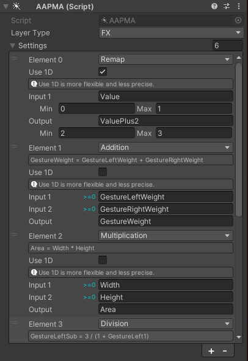

# Animated Animator Parameters for MA

[Animated Animator Parameters (AAP)](https://vrc.school/docs/Other/AAPs/) utilities

## Install

### VCC用インストーラーunitypackageによる方法（おすすめ）

https://github.com/Narazaka/AAPMA/releases/latest から `net.narazaka.vrchat.aapma-installer.zip` をダウンロードして解凍し、対象のプロジェクトにインポートする。

### VCCによる方法

0. https://modular-avatar.nadena.dev/ja から「ダウンロード（VCC経由）」ボタンを押してリポジトリをVCCにインストールします。
1. https://vpm.narazaka.net/ から「Add to VCC」ボタンを押してリポジトリをVCCにインストールします。
2. VCCでSettings→Packages→Installed Repositoriesの一覧中で「Narazaka VPM Listing」にチェックが付いていることを確認します。
3. アバタープロジェクトの「Manage Project」から「Animated Animator Parameters for MA」をインストールします。

## Usage

`AAPMA` を Add Component して設定します。

## License

[Zlib License](LICENSE.txt)
